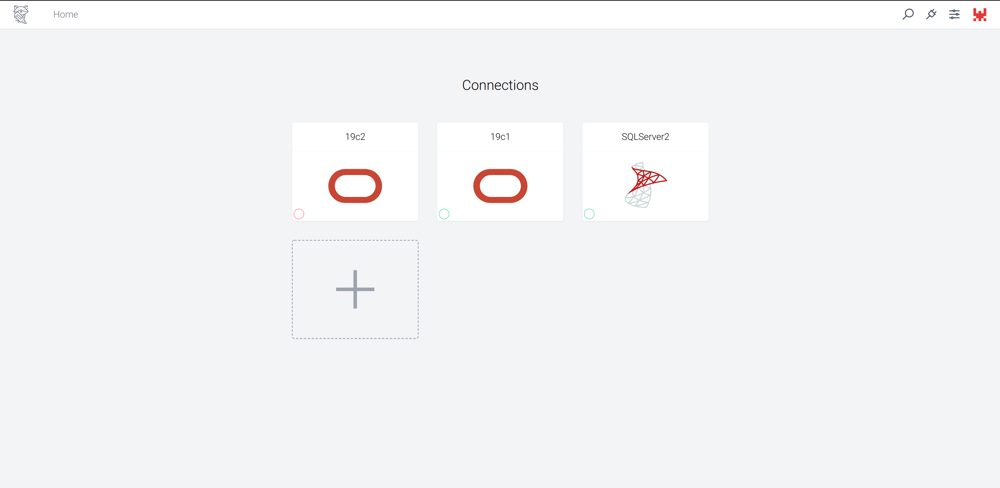
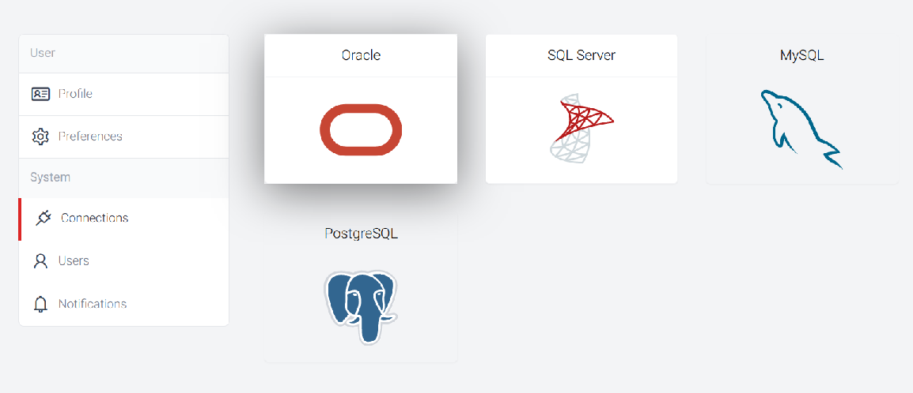
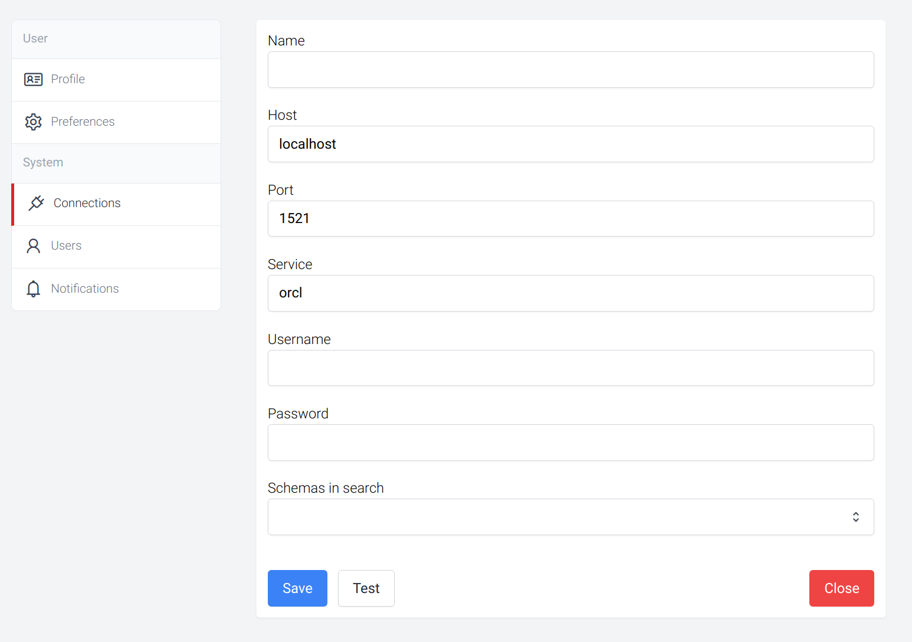

# Oracle

Duck uses Oracle's [DBMS_REDACT](https://docs.oracle.com/en/database/oracle/oracle-database/21/arpls/DBMS_REDACT.html)
package to achive online data masking and redaction. The `DBMS_REDACT` package provides an interface to Oracle Data Redaction, which enables you to mask (redact) data that is returned from queries issued by low-privileged users or an application.

## Connection


### Prerequisites
- Make sure you have the oracle [instant client](https://www.oracle.com/database/technologies/instant-client/downloads.html).
- Set `LD_LIBRARY_PATH` to the location of the instant client. Example;
```sh
export LD_LIBRARY_PATH=/path/to/instantclient_12_2
```

### Create Connection

Navigate to home page and click add connection



Select **oracle** from vendor list



Fill the connection form and click **save**



- **Name**:  A unique name for the connection
- **Host**:  Host name or ip address
- **Port**:  Connection port
- **Service**:  Service name
- **Username**:  Connection username. This user should be able to call `dbms_redact` package.
- **Password**:  Connection password
- **Schemas in search**:  List of schemas that will be used in search operations.


